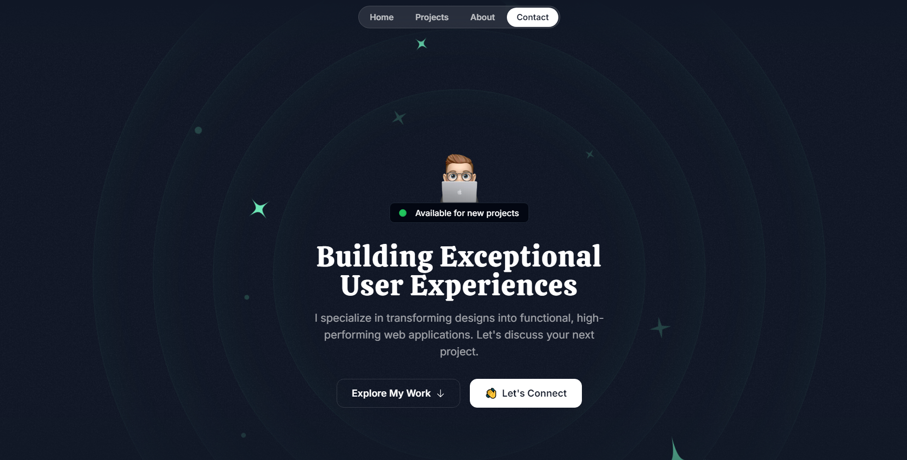

# Single Page Portfolio

[LIVE DEMO](https://dev-portfolio.netlify.app/)



This design was heavily inspired by the Personalfolio Portfolio Template located [here](https://www.figma.com/community/file/1297484254996536416).

## Getting Started

```bash
npm install

cd dev-portfolio

npm run dev
```

## Tech Stack

- **Next.js**: - A React framework with hybrid static & server rendering, and route pre-fetching, etc.
- **TailwindCSS**: A utility-first CSS framework packed to build fast and responsive designs.
- **Framer Motion**: A library to create animations and gestures.
